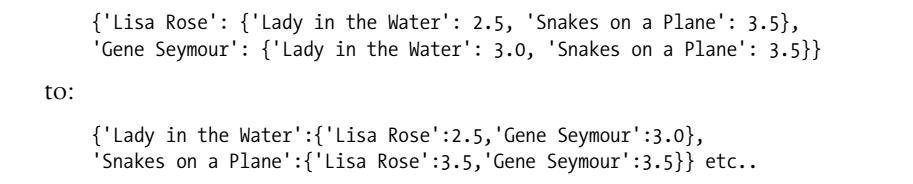

# Smart Web Applications 
   Nowadays in order to to analyze social interaction across the Web we have to write smarter programs to take advantage of the information we collect every day. To this end in this project I'm breaking down the complex subject of machine learning algorithms into practical, easy-to-understand examples that can be used directly.
## Summary 
* Making Recommendations
* Clustering (Discovering Groups)
* Searching and Ranking
* Optimization
* Document Filtering
* Modeling with Decision Trees
* Building Price Models
* Advanced Classification

## 1. Making Recommendations
Collaborative filtering techniques that use a group of people's preferences to make recommendations to other people. 
### Dataset of preferences 
The following dataset represents people and their preferences:


```python
# A nested dictionary of movie critics and their ratings
critics={
    'Lisa Rose': {
        'Lady in the Water': 2.5, 
        'Snakes on a Plane': 3.5,
        'Just My Luck': 3.0, 
        'Superman Returns': 3.5, 
        'You, Me and Dupree': 2.5,
        'The Night Listener': 3.0},
    'Gene Seymour': {
        'Lady in the Water': 3.0, 
        'Snakes on a Plane': 3.5,
        'Just My Luck': 1.5, 
        'Superman Returns': 5.0, 
        'The Night Listener': 3.0,
        'You, Me and Dupree': 3.5},
    'Michael Phillips': {
        'Lady in the Water': 2.5, 
        'Snakes on a Plane': 3.0,
        'Superman Returns': 3.5, 
        'The Night Listener': 4.0},
    'Claudia Puig': {
        'Snakes on a Plane': 3.5, 
        'Just My Luck': 3.0,
        'The Night Listener': 4.5, 
        'Superman Returns': 4.0,
        'You, Me and Dupree': 2.5},
    'Mick LaSalle': {
        'Lady in the Water': 3.0, 
        'Snakes on a Plane': 4.0,
        'Just My Luck': 2.0, 
        'Superman Returns': 3.0, 
        'The Night Listener': 3.0,
        'You, Me and Dupree': 2.0},
    'Jack Matthews': {
        'Lady in the Water': 3.0, 
        'Snakes on a Plane': 4.0,
        'The Night Listener': 3.0, 
        'Superman Returns': 5.0, 
        'You, Me and Dupree': 3.5},
    'Toby': {
        'Snakes on a Plane':4.5,
        'You, Me and Dupree':1.0,
        'Superman Returns':4.0}
}
```

### Finding Similar Users
Now we're going to define some functions to calculate the similarity score. We do this by comparing each person with every other person(how similar people are in their tastes). There are many ways to do that here is some:
* Euclidean distance
* Pearson correlation

For more details check out: 
* [Programming Collective Intelligence](http://shop.oreilly.com/product/9780596529321.do)
* [Metric (mathematics)](http://en.wikipedia.org/wiki/Metric_%28mathematics%29#Examples)


```python
# Euclidean distance function: Returns a score for p1 and p2
from math import sqrt
from __future__ import division
def sim_distance(prefs,person1,person2):
    
    # Get the list of shared_items
    si={}
    for item in prefs[person1]:
        if item in prefs[person2]:
            si[item]=1
            
    # if they have no ratings in common, return 0
    if len(si)==0: return 0
    
    # Sum of squares of all the differences
    sum_of_squares=sum([pow(prefs[person1][item]-prefs[person2][item],2) for item in prefs[person1] if item in prefs[person2]])
    
    return 1/(1+sum_of_squares)


# Pearson correlation coefficient: Returns a score for p1 and p2
def sim_pearson(prefs,p1,p2):
    # Get the list of mutually rated items
    si={}
    for item in prefs[p1]:
        if item in prefs[p2]: 
            si[item]=1
        
    # Find the number of elements
    n=len(si)
    
    # if they are no ratings in common, return 0
    if n==0: return 0
    
    # Add up all the preferences
    sum1=sum([prefs[p1][it] for it in si])
    sum2=sum([prefs[p2][it] for it in si])
    
    # Sum up the squares
    sum1Sq=sum([pow(prefs[p1][it],2) for it in si])
    sum2Sq=sum([pow(prefs[p2][it],2) for it in si])
    
    # Sum up the products
    pSum=sum([prefs[p1][it]*prefs[p2][it] for it in si])

    # Calculate Pearson score
    num=pSum-(sum1*sum2/n)
    den=sqrt((sum1Sq-pow(sum1,2)/n)*(sum2Sq-pow(sum2,2)/n))
    if den==0: return 0
    
    r=num/den
    
    return r
```

### Ranking the Critics
Score everyone against a given persoon and finds the closest matches.


```python
# returns the best matches for a given person 
def topMatches(prefs,person,n=5,similarity=sim_pearson):
    scores=[(similarity(prefs,person,other),other) for other in prefs if other!=person]
    scores.sort()
    scores.reverse()
    return scores[0:n]
```


```python
# top matches for a given person  
topMatches(critics,'Toby',n=5)
```


    [(0.9912407071619299, 'Lisa Rose'),
     (0.9244734516419049, 'Mick LaSalle'),
     (0.8934051474415647, 'Claudia Puig'),
     (0.66284898035987, 'Jack Matthews'),
     (0.38124642583151164, 'Gene Seymour')]


### Recommending Items
In the previous section we have been recommending people that matches for a given person, now we're going to recommend items (movies) for a given person.


```python
# gets recommendations for a person
def getRecommendations(prefs,person,similarity=sim_pearson):
    totals={}
    simSums={}
    for other in prefs:
        # don't compare a person to itself
        if other==person: continue
        sim=similarity(prefs,person,other)
        # ignore scores of zero or lower
        if sim<=0: continue
        for item in prefs[other]:
            # only score movies a person I haven't seen yet
            if item not in prefs[person] or prefs[person][item]==0:
                # similarity * score
                totals.setdefault(item,0)
                totals[item]+=prefs[other][item]*sim
                # sum of similarities
                simSums.setdefault(item,0)
                simSums[item]+=sim
            
    # create the normalized list
    rankings=[(total/simSums[item],item) for item,total in totals.items( )]
    
    # return the sorted list
    rankings.sort( )
    rankings.reverse( )
    return rankings
```


```python
# recommended movies for a given person (Toby in this case)
getRecommendations(critics,'Toby',similarity=sim_distance)
```


    [(3.5002478401415877, 'The Night Listener'),
     (2.7561242939959363, 'Lady in the Water'),
     (2.461988486074374, 'Just My Luck')]


### Matching products 
Now we're going to compare products to each other instead of comparing people (previous sections). In this case the similarity can be defined by looking at who liked a particular item and seeing the other things they liked. 

Before we start we have to swap the people and the items:



```python
# swap the people and the items
def transformPrefs(prefs):
    result={}
    for person in prefs:
        for item in prefs[person]:
            result.setdefault(item,{})
        
            # Flip item and person
            result[item][person]=prefs[person][item]
    return result
```

And now let's test that by finding the set of movies that matches (similar) Superman Returns:


```python
# swap 
movies = transformPrefs(critics)
# returns the best matches for a given movie: 
    # if you're watcging Superman Returns we recommend you these too:
topMatches(movies,'Superman Returns',n=5)
```


    [(0.6579516949597695, 'You, Me and Dupree'),
     (0.4879500364742689, 'Lady in the Water'),
     (0.11180339887498941, 'Snakes on a Plane'),
     (-0.1798471947990544, 'The Night Listener'),
     (-0.42289003161103106, 'Just My Luck')]


Negative correlation scores indicate that those who like the given movie tend to dislike others.

Now let's say you’re trying to decide whom to invite to a premiere? Well, you can get recommended critics for a movie: 


```python
getRecommendations(movies,'Just My Luck')
```


    [(4.0, 'Michael Phillips'), (3.0, 'Jack Matthews')]


```python

```
